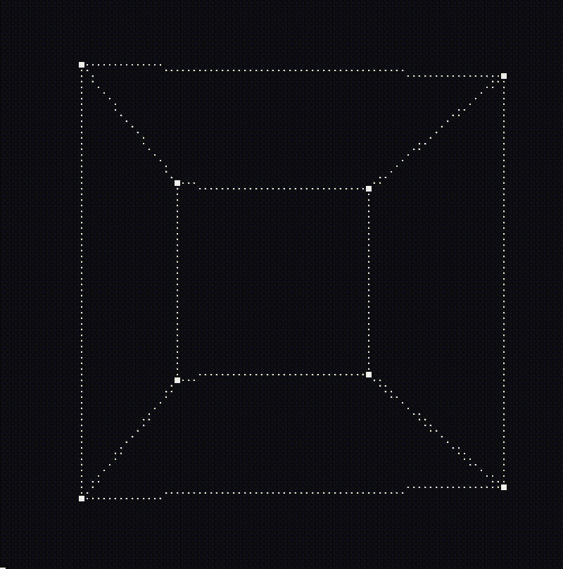
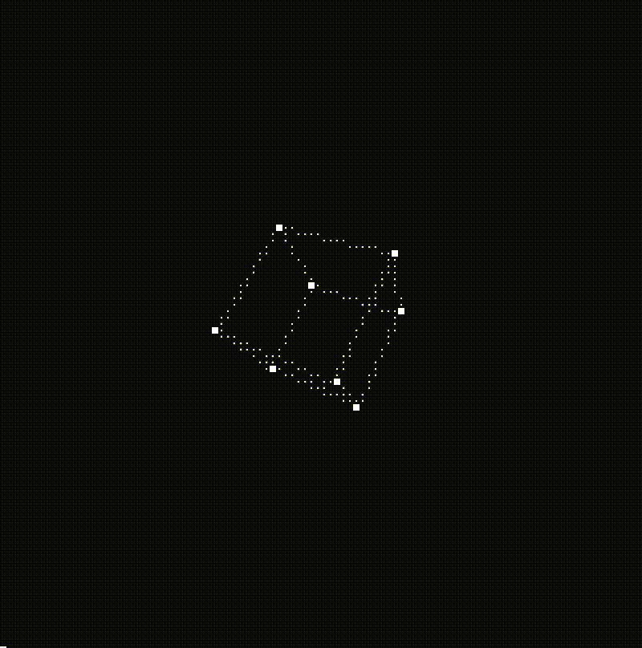
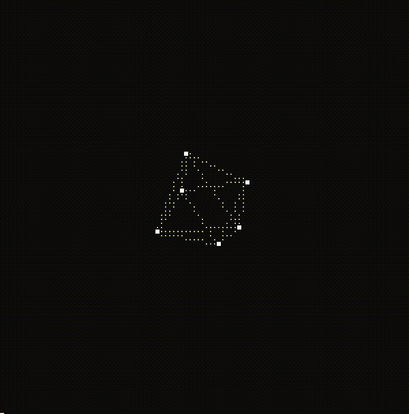
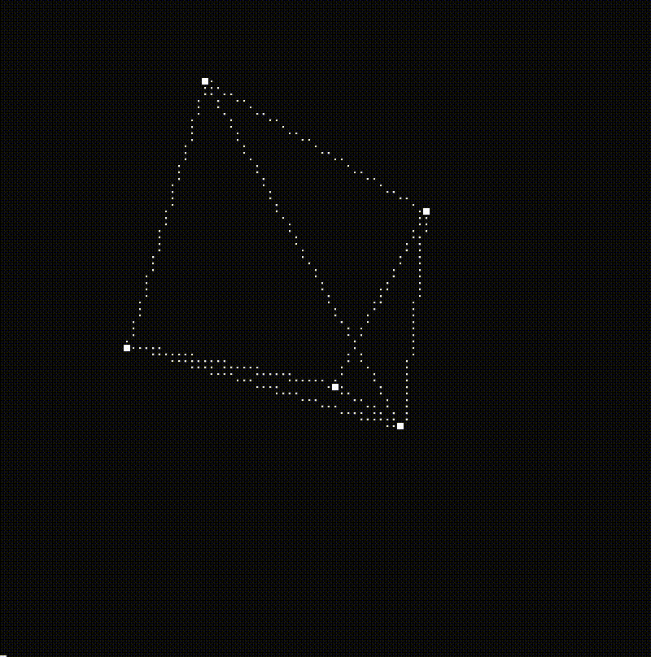
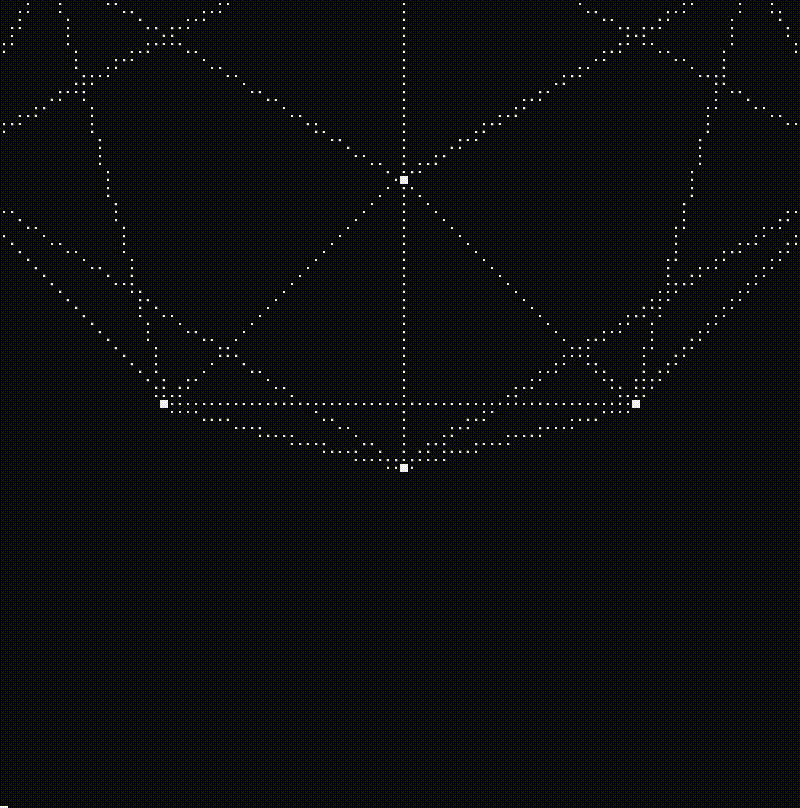
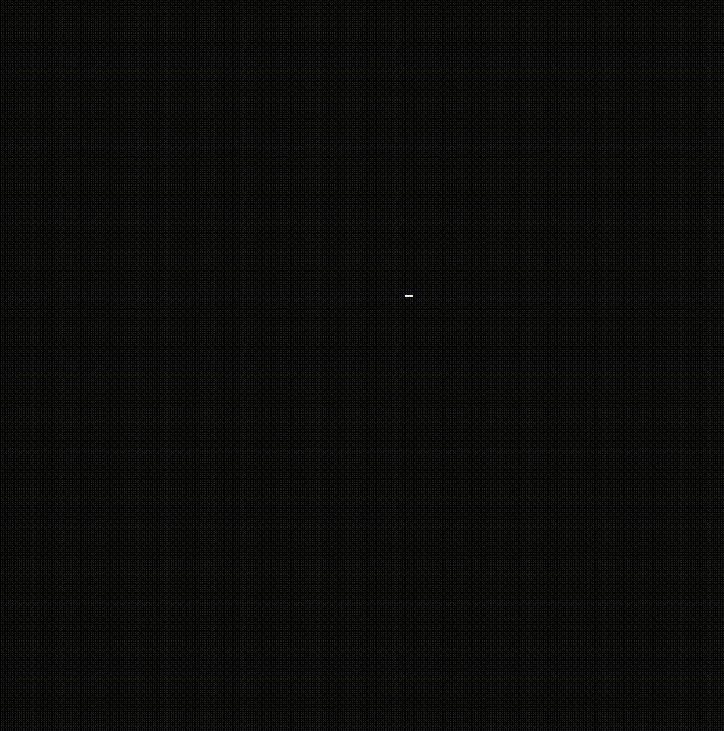
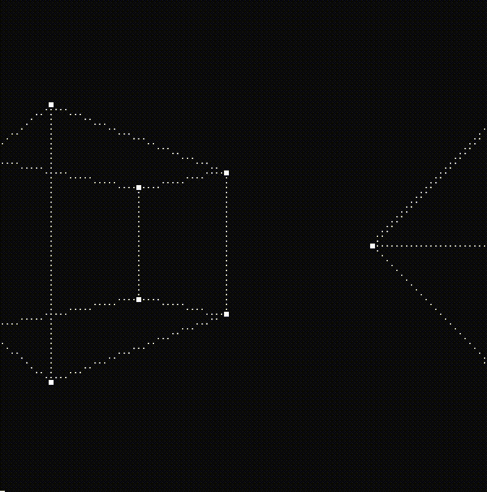

# CONSOLE GRAPHICS 3D

Simple library for generating 3-D models and manipulating them directly in console. Only C++ and no other outer libs.

## Example of basic cube animation ##
Create **Figure_3d** class, set **Console_Screen** settings and put chandes in cycle. 
```CPP
Figure_3d FIGURE("Figures-data/cube.dat");
Console_Screen SCREEN(100, 100, 50, 50, 50);

while(true)
{
    // Clear screen
    SCREEN.clear();

    // Rotate figure
    FIGURE.rotate_3d(0, 2, 0, 50, 50, 0);

    // Put figure on screen and print
    SCREEN.set_figure(FIGURE);
    SCREEN.print();
}
```

Result:



## Other examples ##

You can generate any figures you can imagine and make any animations for them.













## Combined animation ##

You can also add more figures and make combined animations.

```CPP
Figure_3d FIGURE1("Figures-data/cube.dat");
Figure_3d FIGURE2("Figures-data/octahedron.dat");
Console_Screen SCREEN(100, 100, 50, 50, 50);

// Move figures from center
FIGURE1.translate_3d(0, 0, 50);
FIGURE2.translate_3d(0, 0, -50);

while (true)
{
    // Clear screen
    SCREEN.clear();

    // Roatate figures
    FIGURE1.rotate_3d(0, 2, 0, 50, 50, 0);
    FIGURE2.rotate_3d(0, 2, 0, 50, 50, 0);

    // Put figures on screen and print
    SCREEN.set_figure(FIGURE1);
    SCREEN.set_figure(FIGURE2);
    SCREEN.print();
}
```

